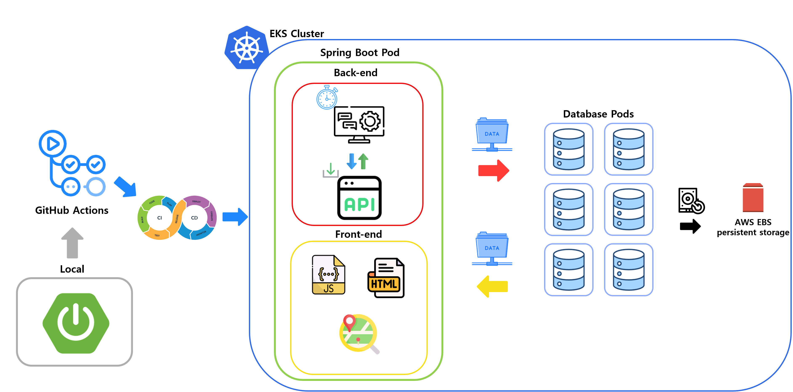

## 프로젝트 소개
 현대 사회에서 대기 오염은 중요한 환경 문제 중 하나로 대두되고 있으며, 특히 미세먼지는 인체 건강에 심각한 영향을 미치는 주요 오염 물질로 주목받고 있다. 미세먼지는 호흡기 질환, 심혈관 질환, 다양한 만성 질환의 원인이 될 수 있다. 이러한 이유로 미세먼지의 실시간 모니터링과 정확한 데이터 수집 및 분석은 대기 질 관리에 있어 필수적이다. 본 논문에서는 이러한 필요성에 대응하기 위해 쿠버네티스(Kubernetes) 및 스프링 부트(Spring Boot)와 같은 최신 기술을 활용하여 미세먼지 데이터를 효과적으로 수집하고 시각화하는 방법을 제시한다. 이를 통해 사용자들은 시각화된 정보를 바탕으로 실시간으로 미세먼지 농도를 파악할 수 있다. 제안된 시스템은 확장성을 고려하여 설계되었으며, 클라우드 환경에서 효율적으로 운영될 수 있는 기반을 제공한다.

## 핵심 기능
- **외부 미세먼지 정보 API 연동:** 한국환경공단의 API를 통해 실시간 미세먼지 정보 수집
- **네이버 지도 API를 통한 정보 시각화:** 수집된 데이터를 시각적으로 표현하여 사용자 편의성 증대
- **AWS EKS를 통한 Kubernetes 배포 및 운영:** 자가 치유 기능과 함께 시스템의 안정성을 극대화하고 서비스 중단 시간을 최소화
- **지속적 통합 / 배포:** CI/CD 파이프라인을 통해 자동화된 배포를 통해 유지보수 효율성을 극대화

## 시스템 구조
시스템 아키텍처에 대한 설명이다. 개발자는 먼저 로컬 개발 환경(local development environment)에서 코드를 작성한 후, 이를 깃허브 액션(GitHub Actions)을 통해 지속적 통합(CI) 파이프라인으로 처리했다. 해당 파이프라인은 코드를 실행하고 테스트하여 스프링 부트 기반의 백엔드(Back-end)와 프론트엔드(Front-end) 컴포넌트로 분리한다. 빌드 된 애플리케이션은 쿠버네티스 클러스터 내의 EKS로 배포되며, 여기서 스프링 부트 파드(Spring Boot Pod)는 백엔드와 프론트엔드로 나누어진다. 백엔드는 스케줄링을 통해 API 데이터를 수집하여 데이터베이스에 저장하는 비즈니스 로직을 처리하고, 프론트엔드는 데이터베이스에서 데이터를 가져와 이를 바탕으로 지도를 표시하는 사용자 인터페이스를 제공한다. 데이터베이스는 별도의 Pod로 배포되며, AWS Elastic Block Store(EBS)를 통해 영구 저장소를 제공한다. 이러한 구조는 마이크로서비스 아키텍처(MSA)를 채택하여 확장성과 유지 보수성을 향상시킨다.



## 프로젝트 결과
 본 프로젝트에서는 쿠버네티스와 스프링 부트를 활용하여 미세먼지 데이터를 수집하고 시각화하는 시스템을 설계 및 구현하였다. 이 시스템은 공공 데이터 API를 통해 실시간으로 미세먼지 데이터를 수집하며, 이를 효율적으로 저장하고 관리하기 위해 쿠버네티스 클러스터 내에서 운영된다. 쿠버네티스 클러스터에서 애플리케이션이 안정적으로 동작하며, 깃허브 액션을 사용한 CI/CD 파이프라인을 통해 코드 변경 사항이 자동으로 테스트 및 배포되어, 시스템의 로드 밸런싱과 유지 보수가 용이해졌다. 사용자는 실시간으로 미세먼지 상태를 시각화된 지도에서 확인할 수 있으며, 이를 통해 적절한 조치를 취할 수 있을 것으로 기대된다. 향후에는 수집된 정보를 바탕으로 미세먼지 예측 시스템을 개발할 예정이다.


##쿠버네티스 환경 설졍 명령어
```bash
#### 기본 네임스페이스 설정
kubectl ns default

#### 각 가용 영역(ap-northeast-2a, 2b, 2c, 2d)에서 첫 번째 노드의 주소를 변수에 저장
N1=$(kubectl get node --label-columns=topology.kubernetes.io/zone --selector=topology.kubernetes.io/zone=ap-northeast-2a -o jsonpath={.items[0].status.addresses[0].address})
N2=$(kubectl get node --label-columns=topology.kubernetes.io/zone --selector=topology.kubernetes.io/zone=ap-northeast-2b -o jsonpath={.items[0].status.addresses[0].address})
N3=$(kubectl get node --label-columns=topology.kubernetes.io/zone --selector=topology.kubernetes.io/zone=ap-northeast-2c -o jsonpath={.items[0].status.addresses[0].address})
N4=$(kubectl get node --label-columns=topology.kubernetes.io/zone --selector=topology.kubernetes.io/zone=ap-northeast-2d -o jsonpath={.items[0].status.addresses[0].address})

#### 각 노드 주소를 환경 변수로 설정하여 /etc/profile에 저장
echo "export N1=$N1" >> /etc/profile
echo "export N2=$N2" >> /etc/profile
echo "export N3=$N3" >> /etc/profile
echo "export N4=$N4" >> /etc/profile

#### 노드 주소 출력
echo $N1, $N2, $N3, $N4

#### 각 노드에 필요한 패키지 설치
ssh ec2-user@$N1 sudo yum install links tree jq tcpdump sysstat -y
ssh ec2-user@$N2 sudo yum install links tree jq tcpdump sysstat -y
ssh ec2-user@$N3 sudo yum install links tree jq tcpdump sysstat -y
ssh ec2-user@$N4 sudo yum install links tree jq tcpdump sysstat -y

#### 보안 그룹 설정
NGSGID=$(aws ec2 describe-security-groups --filters Name=group-name,Values=*ng1* --query "SecurityGroups[*].[GroupId]" --output text)
aws ec2 authorize-security-group-ingress --group-id $NGSGID --protocol '-1' --cidr 192.168.1.100/32

#### IRSA 계정 생성
eksctl create iamserviceaccount \
  --name ebs-csi-controller-sa \
  --namespace kube-system \
  --cluster ${CLUSTER_NAME} \
  --attach-policy-arn arn:aws:iam::aws:policy/service-role/AmazonEBSCSIDriverPolicy \
  --approve \
  --role-only \
  --role-name AmazonEKS_EBS_CSI_DriverRole

#### IRSA 권한 확인
eksctl get iamserviceaccount --cluster ${CLUSTER_NAME}

#### EBS 드라이버 설치 및 권한 확인
eksctl create addon --name aws-ebs-csi-driver \
  --cluster ${CLUSTER_NAME} \
  --service-account-role-arn arn:aws:iam::${ACCOUNT_ID}:role/AmazonEKS_EBS_CSI_DriverRole \
  --force

kubectl get pod -n kube-system -l app=ebs-csi-controller -o jsonpath='{.items[0].spec.containers[*].name}' ; echo

kubectl get daemonset -n kube-system -l app.kubernetes.io/name=aws-ebs-csi-driver -o jsonpath='{.items[0].spec.template.spec.containers[*].name}' ; echo

kubectl get csinodes

#### VPC ID 조회
VPC_ID=$(aws ec2 describe-vpcs --query 'Vpcs[*].{VpcId:VpcId}' --output text)
echo "VPC_ID=$VPC_ID"

#### 퍼블릭 서브넷 CIDR 블록 설정
PUBLIC_SUBNETS_CIDR=("192.168.1.0/24" "192.168.2.0/24" "192.168.3.0/24" "192.168.4.0/24")

#### 프라이빗 서브넷 CIDR 블록 설정
PRIVATE_SUBNETS_CIDR=("192.168.11.0/24" "192.168.12.0/24" "192.168.13.0/24" "192.168.14.0/24")

#### 서브넷 정보 조회
SUBNET_IDS=$(aws ec2 describe-subnets --filters "Name=vpc-id,Values=$VPC_ID" --query 'Subnets[*].[SubnetId,CidrBlock]' --output text)
echo "SUBNET_IDS=$SUBNET_IDS"

#### 퍼블릭 서브넷에 태그 추가
for CIDR in "${PUBLIC_SUBNETS_CIDR[@]}"; do
  echo "Processing CIDR: $CIDR"
  SUBNET_ID=$(echo "$SUBNET_IDS" | grep "$CIDR" | awk '{print $1}')
  echo "SUBNET_ID=$SUBNET_ID"
  if [ -n "$SUBNET_ID" ]; then
    aws ec2 create-tags --resources $SUBNET_ID --tags Key=kubernetes.io/role/elb,Value=1
    echo "Added tag to $SUBNET_ID"
  fi
done

#### 프라이빗 서브넷에 태그 추가
for CIDR in "${PRIVATE_SUBNETS_CIDR[@]}"; do
  echo "Processing CIDR: $CIDR"
  SUBNET_ID=$(echo "$SUBNET_IDS" | grep "$CIDR" | awk '{print $1}')
  echo "SUBNET_ID=$SUBNET_ID"
  if [ -n "$SUBNET_ID" ]; then
    aws ec2 create-tags --resources $SUBNET_ID --tags Key=kubernetes.io/role/internal-elb,Value=1
    echo "Added tag to $SUBNET_ID"
  fi
done

#### 모든 서브넷의 태그 확인
aws ec2 describe-subnets --filters "Name=vpc-id,Values=$VPC_ID" --query 'Subnets[*].{ID:SubnetId,Tags:Tags}' --output table

#### 로드 밸런서 컨트롤러 설치
eksctl utils associate-iam-oidc-provider --region ap-northeast-2 --cluster myeks --approve

eksctl create iamserviceaccount \
  --region ap-northeast-2 \
  --name aws-load-balancer-controller \
  --namespace kube-system \
  --cluster myeks \
  --attach-policy-arn arn:aws:iam::(IAM계정번호):policy/AWSLoadBalancerControllerIAMPolicy \
  --approve

#### Helm 리포지토리 추가 및 업데이트
helm repo add eks https://aws.github.io/eks-charts
helm repo update

#### NLB Load Balancer Controller 설치
helm install aws-load-balancer-controller eks/aws-load-balancer-controller \
  --namespace kube-system \
  --set clusterName=myeks \
  --set region=ap-northeast-2 \
  --set vpcId=$VPC_ID \
  --set serviceAccount.create=false \
  --set serviceAccount.name=aws-load-balancer-controller

#### 서비스 파일 생성 및 배포 (외부 IP 할당)
cat <<EOF > myapp-service.yaml
apiVersion: v1
kind: Service
metadata:
  name: myapp-service
  namespace: default
spec:
  selector:
    app: myapp
  ports:
    - protocol: TCP
      port: 80
      targetPort: 8081
  type: LoadBalancer
EOF

kubectl apply -f myapp-service.yaml

#### 외부 IP 확인
kubectl get svc myapp-service -o jsonpath='{.status.loadBalancer.ingress[0].hostname}'

#### 로드 밸런서 웹훅 서비스 확인
kubectl get endpoints -n kube-system aws-load-balancer-webhook-service
kubectl get svc -n kube-system aws-load-balancer-webhook-service
kubectl get pods -n kube-system -l app.kubernetes.io/name=aws-load-balancer-controller

#### helm 상태 확인
helm status aws-load-balancer-controller -n kube-system
helm list -n kube-system

#### 쿠브 옵스 뷰 설치
helm repo add geek-cookbook https://geek-cookbook.github.io/charts/
helm repo update
helm install kube-ops-view geek-cookbook/kube-ops-view --version 1.2.2 --set env.TZ="Asia/Seoul" --namespace kube-system

kubectl patch svc -n kube-system kube-ops-view -p '{"spec":{"type":"LoadBalancer"}}'

kubectl get svc -n kube-system kube-ops-view -o jsonpath={.status.loadBalancer.ingress[0].hostname} | awk '{ print "KUBE-OPS-VIEW URL = http://"$1":8080/#scale=1.5"}'
